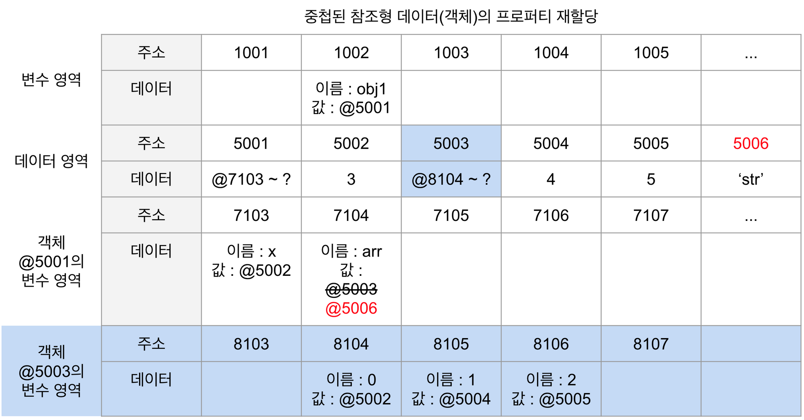

# 01장 데이터 타입

## 1-1. 데이터 타입의 종류

- 기본형
  - Number, String, boolean
  - null, undefined
  - Symbol(ES6)
  - 값이 담긴 주솟값을 바로 복제
  - 불변성
- 참조형
  - Object
  - Array
  - Function, Date, RegExp
  - Map, WeakMap, Set, WeakSet(ES6)
  - 모두 객체의 하위 분류에 속함
  - 값이 담긴 주솟값들로 이루어진 묶음을 가리키는 주솟값을 복제

## 1-2. 데이터 타입에 관한 배경지식

### 1-2-1. 메모리와 데이터

- 비트는 고유한 식별자를 통해 위치를 확인
- 비트 → 바이트(8비트)
- 자바, C언어 등 정적 타입 언어는 메모리의 낭비를 최소화하기 위해 데이터 타입별로 할당할 메모리 영역이 다름
- js는 메모리 용량이 월등히 커진 상황에서 등장
- 메모리 공간에 엄격하지 않아 형변환에 대한 복잡도가 낮음
- 모든 데이터는 바이트 단위의 식별자, 즉 메모리 주솟값을 통해 서로 구분하고 연결

### 1-2-1. 식별자와 변수

- 변수 : 변할 수 있는 무언가(= 데이터)
- 식별자 : 어떤 데이터를 식별하는 데 사용하는 이름, 즉 변수명

## 1-3. 변수 선언과 데이터 할당

### 1-3-1. 변수 선언

- 변수 : 변경 가능한 데이터가 담길 수 있는 그릇

🔍 **동작 원리**

```jsx
var a;
```

- 메모리에서 비어있는 공간 확보
- 그 공간의 이름(식별자)을 a라고 지정
- 이후 사용자가 a에 접근하고자 하면 컴퓨터는 메모리에서 a에 담긴 데이터를 반환

### 1-3-2. 데이터 할당

```jsx
var a; // 변수 a 선언
a = "abc"; // 변수 a에 데이터 할당
var a = "abc"; // 변수 선언과 할당 한 문장으로 표현
```

데이터 할당에 대한 메모리 영역의 변화


- 변수 영역에서 빈 공간 확보
- 확보한 공간의 식별자 a 지정(변수명)
- 데이터 영역의 빈 공간에 문자열 ‘abc’ 저장
- 변수 영역에서 a라는 식별자 검색
- 앞서 저장한 문자열의 주소(5004)를 확보한 공간에(1003) 대입

🤔 왜 변수 영역에 바로 값을 대입하지 않는 것일까?

- 데이터 변환을 자유롭게 하기 위함과 메모리 효율적 관리 위함
- 숫자형은 64비트를 차지하는 반면 문자열은 정해진 규격 X
  - 영어, 한국어 등 각 언어마다 필요한 메모리 용량이 가변적이기 때문
- 미리 확보한 공간 내에서 데이터를 변환해야 한다면 변환된 데이터 크기에 맞게 또 공간을 조정해야 하며 이는 컴퓨터가 처리해야 하는 연산 증가로 이어짐
- 만약 ‘abc’가 아닌 ‘abcdef’로 변경한다면 5004에서 바꾸는 게 아니라 새로운 데이터 영역에 저장되고 기존 변수 영역의 값의 주소가 변경됨
  - 기존의 공간을 바꾸는 것이 아닌 새로운 별도의 공간을 저장하는 것
- 데이터 영역을 분리하게 되면 해당 값에 대해 여러 변수가 참조할 수 있기 때문에 중복된 데이터에 대한 처리 효율 증가

## 1-4. 기본형 데이터와 참조형 데이터

### 1-4-1. 불변값

- 변수와 상수를 구별하는 성질 : 변수 영역 메모리의 변경 가능성
  - 한 번 데이터 할당이 이뤄진 변수 공간에 다른 데이터 재할당 가능 여부
- 불변성 여부 구별하는 성질 : 데이터 영역 메모리의 변경 가능성
  - 문자열, 숫자 boolean, null, undefined, Symbol

```jsx
var a = "abc";
a = a + "def"; // 기존 'abc'가 변한 것이 아닌 새로운 'abcdef' 주소를 저장

var b = 5;
var c = 5; // b와 c는 같은 주소값을 가짐
b = 7; // 기존 5를 7로 바꾸는 것이 아닌 7의 주소값을 가지는 것.
```

### 1-4-2. 가변값

참조형 데이터의 할당

```jsx
var obj1 = {
  a: 1,
  b: "bbb",
};
obj1.a = 2; // 프로퍼티 재할당
```


- 변수 영역에 빈 공간 (@1002) 확보
- 객체의 프로퍼티들을 별도의 변수 영역에 저장하고 이 변수 영역의 주소를 데이터 영역에 저장함

기본형 데이터와 참조형 데이터 차이

- 객체의 변수(프로퍼티) 영역이 별도로 존재
- 기본형은 불변값, 참조형은 가변값
- 데이터 영역에 저장된 값은 모두 불변값 !

참조형 데이터의 프로퍼티 재할당


- a를 다른 값으로 변경하는 경우 obj1 이 가진 @5001이 변하는 것이 아님
- 즉, 새로운 객체가 아니라 기존 객체 내부의 값이 변경되는 것

중첩 객체의 프로퍼티 할당

```jsx
var obj = {
  x: 3,
  arr: [3, 4, 5],
};
```

- 변수 obj의 공간 확보 @1002
- 데이터 영역은 각 프로퍼티들의 주소를 모아둠
- 각 프로퍼티들은 각 변수 영역들을 가짐 @7103, @7104
- 이때 arr은 객체(배열)이기 때문에 @7104는 arr 변수 영역을 마련하고, 각 프로퍼티들 영역 주소 정보를 가짐

객체인 프로퍼티를 기본형 데이터로 재할당하는 경우

```jsx
obj.arr = "str";
```



- arr의 변수 영역인 @7104 주소가 바뀜
- 그럼 @5003을 참조하는 변수가 없음
  - 참조 카운트 : 자신의 주소를 참조하는 변수의 개수
- 참조 카운트가 0인 메모리 주소는 가비지 컬레터(GC)의 대상
  - GC : 런타임 환경에 따라 특정 시점이나 메모리 사용량이 포화 상태에 임박할 때마다 자동으로 수거 대상을 수거
  - 수거된 메모리는 다시 빈 공간이 됨 (파란색)

### 1-4-3. 변수 복사 비교

```jsx
var a = 10;
var b = a;

var obj1 = { c: 10, d: "ddd" };
var obj2 = obj1;

b = 15;
obj2.c = 20; // 내부 프로퍼티 변경
obj2 = { c: 20, d: "ddd" }; // 이건 아예 새로운 객체 할당이기 떄문에 ob1j과 다른 주소값을 참조
```


- 기본형과 참조형 모두 같은 주소를 바라보고 있음
- 그러나 할당 과정이 다른만큼, 복사 이후 동작에 차이 있음

복사 이후 값 변경을 한다면 ?

- 기본형 b는 새로운 주소로 변경
- 참조형 obj.c의 값이 바뀌나
- 결론적으로 참조형 데이터의 값은 변경되지 않음 !
- a와 b는 다른 주소를 바라보지만 obj1과 obj2는 여전히 같은 객체

- 모든 자바스크립트의 데이터 타입들은 주솟값을 복사함.
- 다만 기본형은 주솟값을 복사하는 과정이 한 번인 반면, 참조형은 한 단계 더 거침

## 1-5. 불변 객체 (immutable object)

### 1-5-1. 불변 객체를 만드는 간단한 방법

- 참조형 데이터의 가변은 데이터 자체가 아닌 내부 프로퍼티를 변경할 떄만 성립
- 불변 객체가 필요한 경우 : 원본 객체는 유지해야 하는 경우
  ```jsx
  var copyObject = function (target) {
    var result = {};
    for (var prop in target) {
      result[prop] = target[prop];
    }
    return result;
  };
  ```
  - 객체 프로퍼티 복사
  - 얕은 복사만 수행
  - 문제 : 중첩된 객체를 복사하게 되면 그 주솟값만 복사함 (동일한 주소를 참조)
  - 객체의 프로퍼티가 참조형인 경우 다시 그 내부 프로퍼티를 복사해야 함

### 1-5-2. 얕은 복사와 깊은 복사

- 얕은 복사 : 바로 아래 단계의 값만 복사
- 깊은 복사 : 내부 모든 값들을 복사하는 것

  ```jsx
  var copyObjectDeep = function (target) {
    var result = {};
    if (typeof target === "object" && target !== null) {
      // 참조형
      for (var prop in target) {
        result[prop] = target[prop];
      }
    } else {
      // 기본형
      result = target;
    }

    return result;
  };
  ```

- JSON 활용한 깊은 복사

```jsx
var copyObjecViaJSON = function (target) {
  return JSON.parse(JSON.stringify(target));
};
```

## 1-6. undefined와 null

`undefined`

- 개발자가 명시적으로 지정하는 경우
  - undefined 그 자체가 값
  - 실존하는 데이터
- JS 엔진이 자동으로 부여하는 경우
  - 개발자가 값을 지정할 것이라는 예상되는 상황임에도 값이 지정되지 않은 경우
  - 문지 그대로 값이 없음을 의미
  1. 값을 대입하지 않은 변수에 접근할 때
  2. 객체 내부에 존재하지 않는 프로퍼티에 접근할 때
  3. return 문이 없거나 호출되지 않는 함수의 실행 결과

```jsx
var a;
console.log(a); // (1) undefined

var obj = { a: 1 };
console.log(obj.b); // (2) undefined
console.log(b); // ReferenceError

var func = function () {};
var c = func();
console.log(c); // (3) undefined
```

undefined와 배열

```jsx
var arr1 = [];
arr1.length = 3;
console.log(arr1); // [empty x 3]

var arr2 = new Array(3);
console.log(arr2); // [empty x 3]

var arr3 = [undefined, undefined, undefined];
console.log(arr3; // [undefined, undefined, undefined]
```

- 비어있는 요소는 순회와 관련된 메소드에서 제외 대상

`null`

- ‘비어있음’을 명시적으로 나타내고 싶을 때 사용
- typeof null 은 object
- 변수 값이 null인지 판단하기 위해 typeof 가 아닌 일치 연산자 `===` 사용
  - 동등 연산자 `==` 는 null, undefined 같다고 판단

```jsx
var n = null;
console.log(typeof n); // object

console.log(n == undefined); // true
console.log(n == null); // true

console.log(n === undefined); // false
console.log(n === null); // true
```

## 1-7. 정리

- 자바스크립트 데이터 타입

  - 기본형
    - 불변값
  - 참조형
    - 가변값

- 변수 : 변경 가능한 데이터가 담길 수 있는 공간
- 식별자 : 그 변수의 이름 = 변수명

- 변수 선언 시

  - 컴퓨터는 메모리의 빈 공간에 식별자 저장
  - 그 공간에 자동으로 undefined 할당
  - 그 이후 기본형 할당 시 별도의 공간에 데이터 저장 후 그 공간의 주소를 변수의 값 영역에 할당
  - 참조형 할당 시 내부 프로퍼티 변수 영역들을 저장, 그 주소들 별도의 공간에 저장, 이 주소가 최종적으로 저장

- undefined : 어떤 변수에 값이 존재하지 않음
- null : 값이 없음을 표현하기 위해 개발자가 대입하는 값
