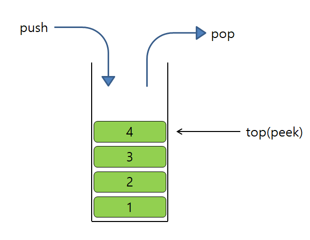
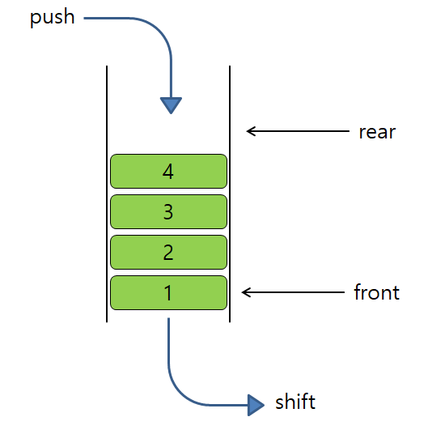
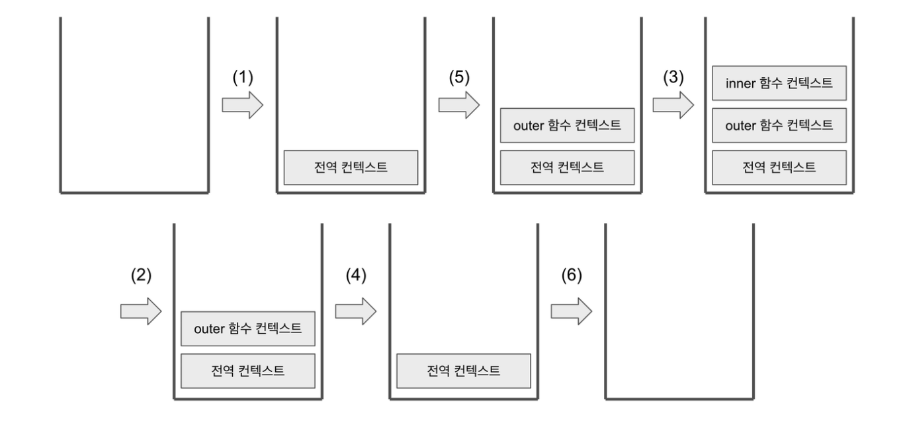
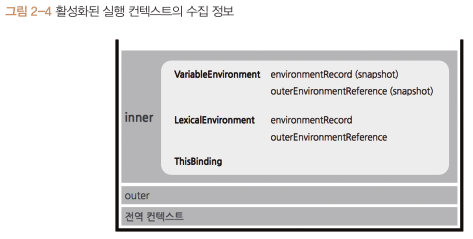

# 2장 실행 컨텍스트

- 실행할 코드에 제공할 환경 정보들을 모아놓은 객체

## 2-1. 실행 컨텍스트란?

🔍 스택



- 후입선출
- stack overflow : Stack 영역의 메모리가 지정된 범위를 넘어갈 때 발생

🔍 큐



- 선입선출

실행 컨텍스트

- 동일한 환경에 있는 코드들을 실행할 때 필요한 환경 정보들을 모아 컨텍스트 구성
  - 동일한 환경
  - 전역공간, 함수 등
- 이를 콜 스택(call stack)에 쌓아 올리고
- 가장 위에 쌓여있는 컨텍스트와 관련 있는 코드들을 실행하여 전체 코드의 환경과 순서를 보장

실행 컨텍스트와 콜 스택

```jsx
// ---------------------------- (1)
var a = 1;
function outer() {
  function inner() {
    console.log(a); // undefined
    var a = 3;
  }
  inner(); // ----------------- (2)
  console.log(a); // 1
}
outer(); // ------------------- (3)
console.log(a); // 1
```



- (1) 코드 실행
  - 전역 컨텍스트가 콜 스택에 담김
  - 최상 단의 공간은 별도의 실행 명령 없이 브라우저에서 자동으로 실행되기 때문에 js파일이 열리는 순간 전역 컨텍스트 활성화됨
- (3) 에서 함수 호출
  - js 엔진이 outer에 대한 환경 정보를 수집해서 outer 실행 컨텍스트를 생성한 후 콜 스택에 담음
  - 콜 스택 맨 위에 outer 실행 컨텍스트가 있으니 전역 컨텍스트와 관련된 코드 실행을 멈추고 outer와 관련한 코드, 즉 outer 내부 코드를 순차적으로 실행함
- (2) inner 함수 호출
  - inner함수 실행 컨텍스트가 콜 스택 맨 위에 담김
  - outer 실행 멈추고 inner 내부 코드 순차적으로 실행
- inner 함수가 끝나면 inner가 콜스택에서 제거
- 중단됐던 outer가 마저 실행되고 다 실행된 후 콜 스택에서 제거
- 중단됐던 전역 컨텍스트가 마저 실행하고 끝나면 콜 스택에서 제거되어 콜 스택 비어짐

- 어떤 실행 컨텍스트가 콜 스택 맨 위에 쌓이는 순간이 곧 현재 실행할 코드에 관여하게 되는 시점
- 해당 컨텍스트가 활성화될 때 js엔진이 해당 컨텍스트에 관련된 코드를 실행하는 데 필요한 환경 정보 수집해서 실행 컨텍스트 객체에 저장
- 활성화된 실행 컨텍스트의 수집 정보
  
  - `VariableEnvironment` : 현재 컨텍스트 내의 식별자들에 대한 정보 + 외부 환경 정보, 선언 시점의 LexicalEnvironment의 스냅샷으로 변경 사항은 반영되지 않음
  - `LexicalEnvironment` : 처음에는 VariableEnvironment와 같지만 변경 사항이 실시간으로 반영됨
  - `ThisBinding` : this 식별자가 바라봐야 할 대상 객체

## 2-2. VariableEnvironment

- VE에 담기는 내용은 LE와 같지만 최초 실행 시의 스냅샷을 유지한다는 점이 다름
- 실행 컨텍스트를 생성할 때 VE에 정보를 담은 후 이를 복사하여 LE를 만들고, 이후에는 LE를 주로 활용
- VE와 LE 내부에는 environmentRecord와 outer-EnvironmentReference로 구성
  - 초기화 과정 중에는 이 둘은 동일
  - 코드 진행에 따라 달라짐 (VE는 스냅샷)

## 2-3. LexicalEnvironment(정적 환경)

- 정적 환경 : 수시로 변하는 환경 정보 의미

### 2-3-1. environmentRecord와 호이스팅

environmentRecord

- 현재 컨텍스트와 관련된 코드의 식별자 정보들이 저장
- 해당 함수의 매개변수 식별자, 선언한 함수, var로 선언된 변수의 식별자 등이 해당
- 이는 실행되기 전에 수집해둠
- ‘js 엔진은 식별자들을 최상단으로 끌어올려놓은 다음 실제 코드를 실행한다’
- hosting : 실제로 끌어올리지 X 편의상 끌어올린 것으로 간주 (수집O)

🔍 호이스팅 규칙

- 변수는 선언부와 할당부를 나누어 선언부만 수집
- 함수 선언은 함수 전체를 수집
  - 호이스팅이 끝난 상태에서의 함수 선언문은 함수명으로 선언한 변수에 함수를 할당한 것처럼 여길 수 있음 (함수 표현식)

🔍 함수 선언문과 함수 표현식

- 함수 선언문
  - function 정의부만 존재, 별도의 할당 X
  - 반드시 함수명 정의
- 함수 표현식
  - 정의한 function을 별도의 변수에 할당
  - 함수명 필수 아님
  - 기명 함수 표현식 : 함수명 있는 경우
  - 익명 함수 표현식 : 함수명 없는 경우, 일반적으로 사용됨

```jsx
function a() {} // 함수 선언문
a();

var b = function () {}; // 익명 함수 표현식
b();

var c = function d() {}; // 기명 함수 표현식
c();
d(); // 에러
```

- 외부에서 기명 함수 표현식으로 호출할 수 없음
- 해당 함수 내부에서만 접근 가능함 (재귀 함수)
  - 함수가 자신을 다시 호출하는 구조로 만들어진 함수
  - 종료조건이 있어야 하며 없는 경우 무한 반복

```jsx
console.log(sum(1, 2));
console.log(multiply(3, 4)); // 에러 변수 선언만 되어 있음

function sum(a, b) {
  // 함수 선언문
  return a + b;
}

var multiply = function (a, b) {
  // 함수 표현시기
  return a * b;
};

// ------------------ 호이스팅 후
var sum = function (a, b) {
  // 선언문 전체 호이스팅
  return a + b;
};
var multiply; // 표현식은 선언만

/* 그 아래는 동일 */
```

- 선언문은 전체를 호이스팅
- 변수(표현식)는 선언부만 호이스팅

❗전역공간에 동명의 함수가 선언되어 있는 경우

- 동일한 변수명에 서로 다른 값을 할당할 경우, 나중에 할당한 값이 먼저 할당한 값을 덮어씌움(override)

### 2-3-2. 스코프, 스코프 체인, outerEnvironmentReference

- 스코프(scope)
  - 식별자에 대한 유효범위
- js는 전역공간을 제외하면 오직 함수에 의해서만 스코프가 생성됨
- 스코프 체인(scope chain)
  - 식별자의 유효범위를 안에서부터 바깥으로 차례로 검색해나가는 것

🔍 스코프 체인

- outerEnvironmentReference는 현재 호출된 함수가 선언될 당시의 LE를 참조
- 콜 스택 상에서 실행 컨텍스트가 활성화된 상태일 때
- 여러 스코프에서 동일한 식별자를 선언한 경우에는 스코프 체인 상에서 가장 먼저 발견된 식별자에만 접근 가능함

🔍 전역변수와 지역변수

- 전역변수
  - 전역 스코프에서 선언한 변수
- 지역변수
  - 함수 내부에서 선언한 변수

## 2-4. this

- 실행 컨텍스트의 thisBinding에는 this로 지정된 객체가 저장됨

## 2-5. 정리

- 실행 컨텍스트
  - 실행할 코드에 제공할 환경 정보들을 모아둔 객체
  - 활성화되는 시점에 variableEvironment, LexicalEnvironment, ThisBinding 세 가지 정보 수집
  - variableEvironment : 초기 상태 유지 (스냅샷)
  - LexicalEnvironment : 변경사항 반영
  - 둘다 environmentRecord, outerEnvironmentReference로 구성
    - environmentRecord : 매개변수명, 변수의 식별자, 선언한 함수의 함수명
    - outerEnvironmentReference : 직전 컨텍스트의 LexicalEnvironment 정보를 참조
- 호이스팅
  - environmentRecord의 수집과정 추상화
  - 실행 컨텍스트가 관여하는 코드 집단의 최상단으로 끌어올린다고 해석하는 것
  - 선언과 할당이 동시에 이뤄진 문장은 선언부만 호이스팅
- 스코프
  - 변수의 유효범위
  - outerEnvironmentReference는 해당 함수가 선언된 LexicalEnvironment 참조
  - 코드 상에서 어떤 변수에 접근 시 LexicalEnvironment 탐색, 없으면 outerEnvironmentReference에 담긴 LexicalEnvironment 탐색의 과정을 거침
