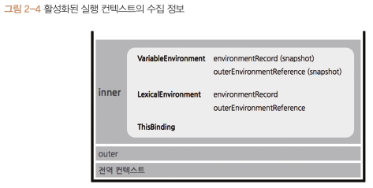

# 05장 클로저

## 5-1. 클로저의 의미 및 원리 이해

💡 클로저(Closure)

- Closure : 닫혀있음, 폐쇄성, 완결성
- 자바스크립트 고유 개념 X, 함수형 프로그래밍 언어의 보편적인 특성

> A closure is the combination of a function and the lexical environment within which that function was declared.

- 클로저는 함수와 그 함수가 선언될 당시의 lexical environment의 상호관계에 따른 현상 (MDN)



- lexicalEnvironment 중에서도 outerEnvironmentReference에 해당
- lexicalEnvironment의 environmentRecord와 outerEnvironmentReference에 의해 변수의 스코프가 결정되고 스코프체인이 가능해짐
- 내부함수에서 외부 변수를 참조하는 경우에만 combination(선언될 당시의 lexicalEnvironment 와의 상호관계)이 의미가 있음
  - A 컨텍스트에서 선언한 내부함수 B의 컨텍스트 중
  - B가 A에서 선언한 변수에 접근하는 경우

외부 함수의 변수를 참조하는 내부 함수 - (1)

```jsx
var outer = function () {
  var a = 1;
  var inner = function () {
    console.log(++a); // 2
  };
  inner();
};
outer();
```

- inner가 실행되면 inner 실행 컨텍스트에서 outerEnvironmentReference에 지정된 상위 컨텍스트인 outer의 LE에 접근하여 a 찾아 증가(2)
- outer 실행 컨텍스트가 종료되면 LE에 저장된 식별자들 참조 지워짐

외부 함수의 변수를 참조하는 내부 함수 - (2)

```jsx
var outer = function () {
  var a = 1;
  var inner = function () {
    return ++a;
  };
  return inner();
};

var outer2 = outer(); // outer 종료, outer2는 inner 참조
console.log(outer2); //2
```

- outer는 inner 함수 실행 결과를 리턴
- outer 실행 컨텍스트가 종료되면 a를 참조하는 대상이 없어짐

외부 함수의 변수를 참조하는 내부 함수 - (3)

```jsx
var outer = function () {
  var a = 1;
  var inner = function () {
    return ++a;
  };
  return inner; // (1)
};

var outer2 = outer(); // (2) outer 종료, outer2는 inner 참조
console.log(outer2); // (3) 2
console.log(outer2); // (4) 3
```

- inner 함수의 실행 결과가 아닌 inner 함수 자체를 리턴
- inner 실행 컨텍스트 outerEnvironmentReference에는 inner 함수가 선언된 위치의 LE가 참조복사
  - outer 함수의 LE가 담김
  - 스코프 체이닝에 따라 outer에서 선언한 변수 a 접근
- inner 함수 실행 시점에는 outer가 실행 종료된 상태인데 어떻게 outer 함수의 LE에 접근할 수 있는 것인가 ?
  - 가비지 컬렉터(GC)의 동작 방식
  - GC는 어떤 값을 참조하는 변수가 하나라도 있으면 수집 대상에 포함하지 않음
  - outer는 함수 실행 종료 시점에 inner 함수를 반환하는데, outer2로 인해 호출될 가능성이 있기 때문 !
  - 따라서 outer의 LE는 GC 수집 대상에서 제외
- **즉** **클로저란**
  - 어떤 함수A에서 선언한 변수a를 참조하는 내부함수를 B를 외부로 전달하는 경우, A의 실행 컨텍스트가 종료된 이후에도 변수 a가 사라지지 않는 현상
  - 함수를 선언할 때 만들어지는 유효범위가 사라진 후에도 호출할 수 있는 함수
  - 이미 생명 주기가 끝난 외부 함수의 변수를 참조하는 함수
  - 자신이 생성될 때의 스코프에서 알 수 있었던 변수들 중 언젠가 자신이 실행될 때 사용할 변수들만을 기억하여 유지시키는 함수

## 5-2. 클로저와 메모리 관리

- 메모리 누수 : **개발자의 의도와 달리** 어떤 값의 참조 카운트가 0이 되지 않아 **CG 수거 대상이 되지 않는 경우**
- 메모리 소모는 클로저의 본질적인 특성
- 클로저는 어떤 필요에 의해 의도적으로 함수의 지역변수를 메모리를 소모하도록 함으로써 발생
  - 필요성이 사라진 시점에 메모리 관리
  - 더는 메모리를 소모하지 않게 , 참조 카운트를 0으로 만들기
  - 식별자에 참조형이 아닌 기본형 데이터 null, undefined 를 할당

## 5-3. 클로저 활용 사례

### 5-3-1. 콜백 함수 내부에서 외부 데이터를 사용하고자 할 때

```jsx
const fruits = ["apple", "banana", "peach"];
const $ul = document.createElement("ul");

fruits.forEach(function (fruit) {
  // (A) forEach 콜백
  var $li = document.createElement("li");
  $li.innerText = fruit;
  $li.addEventListener("click", function () {
    // (B) 이벤트 핸들러
    alert("your choice is " + fruit); // fruit 외부 변수 참조
  });

  $ul.appendChild($li);
});

document.body.appendChild($ul);
```

- (B): (A)가 실행 종료된 이후에도 fruit은 GC에 수집 대상이 되지 않고 계쏙 참조 가능

고차함수 활용

- 고차함수 : 함수를 인자로 받거나 함수를 리턴하는 함수

```jsx
const alertFruitBuilder = function (fruit) {
  // 외부 함수
  return function () {
    // 내부 함수 (1)
    alert("your choice is " + fruit); // 외부 변수 참조
  };
};

fruits.forEach(function (fruit) {
  const $li = document.createElement("li");
  $li.innerText = fruit;
  $li.addEventListener("click", alertFruitBuilder(fruit));
  2;
  $ul.appendChild($li);
});
```

- 이후 클릭 이벤트 발생 시 이 함수의 실행 컨텍스트가 생성되면서 인자로 넘어서 fruit를 outerEnvironmentReferencd에 의해 참조할 수 있음
- fruit가 클로저인 것

### 5-3-2. 접근 권한 제어(정보 은닉)

정보 은닉(information hiding)

- 어떤 모듈의 내부 로직에 대해 외부로의 노출을 최소화해서 모듈 간의 결합도를 낮추고 유연성을 높이고자 하는 개념
- 접근 권한
  - public : 외부에서 접근 가능
  - private : 내부에서만 접근 가능, 외부 노출 X
  - 자바스크립트에는 변수에 접근 권한 직접 부여하지 않음.
  - 클로저를 이용하여 함수 차원에서 public과 private한 값 구분 가능

```jsx
const outer = function () {
  let a = 1;
  const inner = function () {
    return ++a;
  };
  return inner; // (1)
};

const outer2 = outer();
console.log(outer2());
console.log(outer2());
```

- outer 함수는 외부로부터 격리된 공간
- 함수를 실행할 수는 있으나 함수 내부에는 개입 불가
- 외부에서는 오직 outer가 return한 정보에만 접근 가능

  - return 값이 외부에 정보를 제공하는 유일한 수단
  - 외부에 제공하고자 하는 정보들을 모아 return(public)
  - 내부에서만 사용할 정보들은 return하지 않는 것으로 접근 권한 제어 가능 (private)

- 클로저를 활용해 접근제한을 제어하는 방법
  1. 함수에서 지역변수 및 내부함수 등 생성
  2. 외부에 접근권한을 주고자 하는 대상들로 구성된 참조형 데이터(대상이 여럿일 때는 객체나 배열, 하나일 때는 함수)를 return
  - return한 변수들은 public, 그렇지 않은 변수들은 private

### 5-3-3. 부분 적용 함수

부분 적용 함수(partially applied function)

- n개의 인자를 받는 함수에 미리 m개의 인자만 넘겨 기억시켰다가, 나중에 (n-m)개의 인자를 넘기면 비로소 원래 함수의 실행 결과를 얻을 수 있게 하는 함수
- 미리 일부 인자를 넘겨두어 기억하게끔 하고, 추후 필요한 시점에 기억했던 인자들까지 함께 실행
- 예 ) 디바운스 (debounce)

  - 짧은 시간 동안 동일한 이벤트가 많이 발생할 경우 이를 전부 처리하지 않고 처음 혹은 마지막에 발생한 이벤트에 대해 한 번만 처리하는 것

  ```jsx
  const debounce = function (eventName, func, wait) {
    let timeoutId = null;
    return function (event) {
      const self = this;
      console.log(eventName, "event 발생");
      clearTimeout(timeoutId);
      timeoutId = setTimeout(func.bind(self, event), wait);
    };
  };

  const moveHandler = function (e) {
    console.log("move event 처리");
  };

  const wheelHandler = function (e) {
    console.log("wheel event 처리");
  };

  document.body.addEventListener("mouse", debounce("move", moveHandler, 500));
  document.body.addEventListener("mouse", debounce("move", moveHandler, 700));
  ```

  - 최초 이벤트 발생시 timeoutId에 wait 시간 뒤에 func를 실행할 것이라는 내용 담김 (timeoutId는 null 상태) , 타이머 생성
  - wait 시간이 경과하기 전에 동일한 event가 발생하는 경우 clearTimeout에 의해 기존에 생성된 타이머가 삭제되고 새로운 타이머가 생성
  - 최종적으로 마지막에 발생한 이벤트에 대해서만 실행되는 것

### 5-3-4. 커링 함수

커링 함수(currying function)

- 여러 개의 인자를 받는 함수를 하나의 인자만 받는 함수로 나눠서 순차적으로 호출될 수 있게 체인 형태로 구성한 것
- 한 번에 하나의 인자만 전달
- 당장 필요한 정보만 받아서 전달하고 또 필요한 정보가 들어오면 전달하는 식으로, 마지막 인자가 넘어갈 때까지 함수 실행을 미루는 ‘지연 실행’을 수행

```jsx
// 기본 함수
function add(a, b) {
  return a + b;
}

console.log(add(2, 3)); // 출력: 5
// 커링 함수
function curriedAdd(a) {
  return function (b) {
    return a + b;
  };
}

const addTwo = curriedAdd(2); // 첫 번째 인자로 2를 제공
console.log(addTwo(3)); // 출력: 5 (두 번째 인자로 3을 제공)
```

- 한 번에 모든 인자를 받는 것이 아니라 인자 하나씩 함수를 호출하는 것

API 요청에 적용

```jsx
// ES6 (서버에 요청할 주소의 기본 url, path값, id 값, 실제 서버에 정보 요청(fetch) )
const getInformation = (baseUrl) => (path) => (id) =>
  fetch(baseUrl + path + "/" + id);

//url 전달
const ImgUrl = "http://imageAddress.com/";
const getImg = getInformation(ImgUrl);

//path전달
const getEmoticon = getImg("emoticon");
const getIcon = getImg("icon");

//실제요청 (마지막 id만전달) -> 원본함수실행
const emoticon1 = getEmoticon(100);
const emoticon2 = getEmoticon(102);
const icon1 = getIcon(205);
const icon2 = getIcon(234);
const icon3 = getIcon(265);
```

## 5-4. 정리

- 클로저 : 어떤 함수에서 선언한 변수를 참조하는 내부함수를 외부함수로 전달할 경우, 함수의 실행 컨텍스트가 종료된 후에도 해당 변수가 사라지지 않는 현상
- 내부함수를 외부로 전달하는 방법
  - 함수를 return하기
  - 콜백으로 전달
- 클로저의 본질이 메모리를 계속 차지하는 개념이기 때문에 필요하지 않아지는 시점에서는 메모리를 차지하지 않도록 관리
