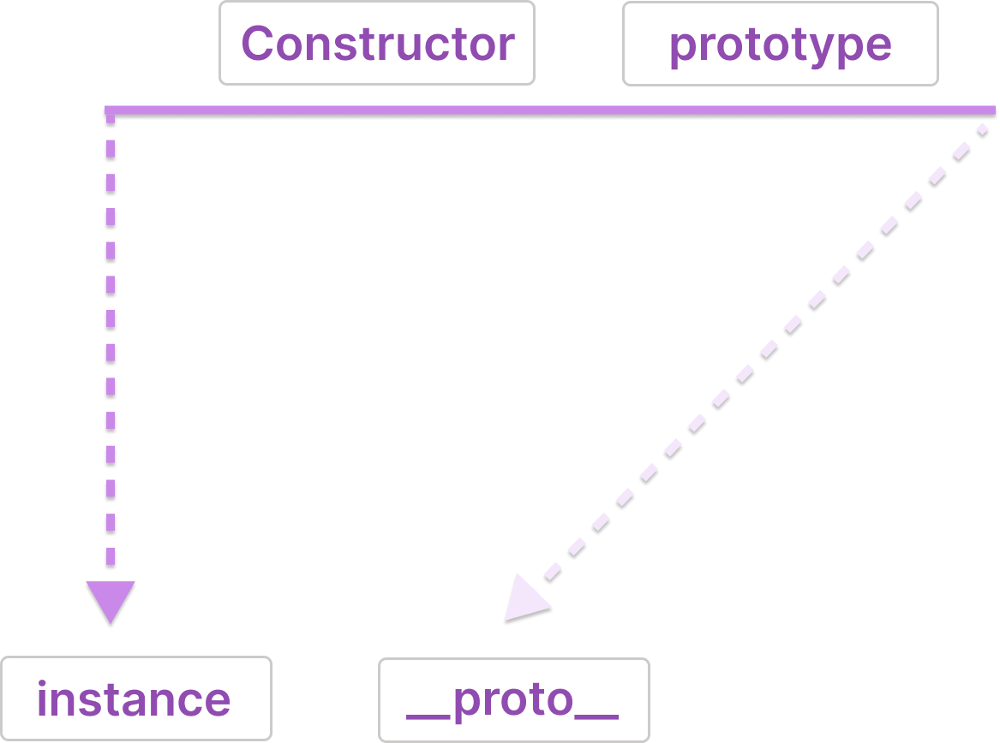

# 6장 프로토타입

- 클래스 기반 언어 : 상속을 사용
- 자바스크립트
  - 프로토타입(prototype) 기반 언어
  - 어떤 객체를 원형(prototype)으로 삼고 이를 참조함으로써 상속과 비슷한 효과

## 6-1. 프로토타입의 개념 이해

### 6-1-1. constructor, prototype, instance



```jsx
var instance = new Constructor();
```

- 어떤 생성자 함수를 new 연산자와 함께 호출하면
- Constructor에서 정의된 내용을 바탕으로 새로운 인스턴스 생성
- 새롭게 생성된 인스턴스에는 `__proto__` 라는 프로퍼티가 자동으로 부여
- 이 프로퍼티는 Constructor의 prototype 이라는 프로퍼티를 참초

🔍 `prototype` 과 `__proto__`

- prototype
  - 객체
  - 인스턴스가 사용할 메서드 저장
  - 생성자 함수로부터 생성된 모든 객체의 공통된 프로퍼티와 메서드를 포함
  - 같은 생성자로부터 생성된 객체는 프로토타입을 공유
- **proto**
  - prototype을 참조하는 객체
  - 객체의 내부 프로퍼티
  - **생략 가능**한 프로퍼티
  - 인스턴스와 생성자 함수의 프로토타입 객체 간의 연결을 하는 역할
  - 주의. `__proto__` 는 비표준 프로퍼티이므로 권장되는 방법 아님. `Object.getPrototypeOf` 메서드를 사용 권장

💡 프로토타입

- js는 함수에 자동으로 객체인 prototype 프로퍼티 생성
- 함수를 생성자 함수로서( = new ) 사용할 경우, 이로 생성된 인스턴스에는 숨겨진 프로퍼티인 **proto**가 자동으로 생성
- **proto**는 생성자 함수의 prototype 참조
- 생성자 함수 프로토타입의 메서드나 프로퍼티를 인스턴스에서도 자신의 것처럼 접근할 수 있는 것

```jsx
var arr = [1, 2];
console.dir(arr);
console.dir(Array);
```

변수 arr


- Array 라는 생성자 함수를 원형으로 삼아 생성
- 프로토타입 내부에 배열 메서드 존재

생성자 함수 Array


- 함수라는 의미의 f


- 배열 인스턴스인 [1,2]
  - 이 인스턴스의 **proto**는 `Array.prototype` 을 참조하며, **proto**는 생략 가능하기 때문에 배열의 각 메서드가 마치 자신(arr)의 것처럼 호출할 수 있는 것
  - Array의 prototype 내부에 있지 않은 from, isArray 등의 메서드들은 인스턴스가 직접 호출 X Array 생성자 함수에 직접 접근해야 함

### 6-1-2. **constructor 프로퍼티**

- 생성자 함수의 프로퍼티인 prototype 객체 내부에 존재
- 인스턴스의 **proto** 객체 내부에도 존재
- 원래의 생성자 함수(자기 자신)을 참조함
- 인스턴스로부터 원형이 무엇인지 파악 가능한 수단 (=원본이 뭐냐)

```jsx
var arr = [1, 2];
Array.prototype.constructor === Array; // true
arr.__proto__.constructor === Array; // true
arr.constructor === Array; // true

var arr2 = new arr.constructor(3, 4);
console.log(arr2); // [3, 4]
```

- 인스턴스의 **proto**가 생성자 함수의 prototype 참조하기 때문
- constructor 프로퍼티는 읽기 전용 속성이 부여된 경우를 제외하면 값을 바꿀 수 있음
  - 기본형 - number, string, boolean
- 모두 동일한 대상 가르킴

```
[Constructor]
[instance].__proto__.constructor
[instance].constrcutor
Object.getPropertyOf([instance]).constrcutor
[Constructor].prototype.constructor
```

## 6-2. 프로토타입 체인

### 6-2-1. 메서드 오버라이드

- prototype에 정의된 프로퍼티나 메서드와 인스턴스가 동일한 이름의 프로퍼티/메서드를 가지고 있는 상황이라면 ?

```jsx
var Person = function (name) {
  this.name = name;
};
Person.prototype.getName = function () {
  return this.name;
};

var iu = new Person("지금");
iu.getName = function () {
  return "바로 " + this.name;
};
console.log(iu.getName()); // 바로 지금
```

- 프로토타입의 getName이 아닌 iu 객체의 getName 메서드 호출
- 메서드 오버라이드
  - 메서드 위에 메서드를 덮어씌운 현상
  - 원본을 제거하고 다른 대상으로 교체하는 것이 아닌, 원본이 그대로 있는 상태에서 다른 대상을 덮어씌운 것
- js 엔진은 가장 가까운 대상인 자신의 프로퍼티로부터 찾아나가는 방식
- 교체가 아닌 얹는 현상. 원본은 그대로 유지되고 있음
- 메서드가 오버라이드된 경우에는 자신으로부터 가장 가까운 메서드에 접근. 원본은 유지되기 때문에 우회적인 방법을 통해 접근 자체는 가능

### 6-2-2. 프로토타입 체인

배열의 내부 도식

- `arr.__proto__`는 Array.prototype을 참조하고 이는 객체이므로 , `Array.prototype.__proto__`는 Object.prototype을 참조
- 배열 리터럴의 **proto**안에 **proto** 존재
- 이는 prototype 객체가 객체이기 때문
- 모든 객체의 **proto**에는 Object.prototype이 연결


- 배열이 Array.prototype 내부의 메서드를 마치 자신의 것처럼 사용하는 것과 같이 Object.prototype 내부의 메서드도 사용할 수 있음

```jsx
var arr = [1, 2];
arr.push(3);
arr.hasOwnProperty(2); // true
```

프로토타입 체인(prototype chain)

- 어떤 데이터의 `__proto__` 프로퍼티 내부에서 다시 `__proto__` 가 연쇄적으로 이어진 것
- 이 체인을 따라가며 검색하는 것이 프로토타입 체이닝
  - 메서드 오버라이드와 동일한 맥락
  - 메서드 호출 → 가장 가까운 **proto**에서 찾고 없으면 다음 **proto**에서 찾는 것


- 배열뿐만 아니라 js 데이터 모두 프로토타입 체인 구조 지님


- 각 생성자 함수는 모두 함수이기 때문에 Function 생성자 함수의 prototype과 연결

### 6-2-3. 객체 전용 메서드의 예외사항

- 언제나 프로토타입 체인의 최상단은 Object.prototype
- 참조형뿐만 아니라 기본형 데이터도 **proto**를 통해 접근할 수 있는 최상위 존재임

## 6-3. 정리

- 어떤 생성자 함수를 new 연산자를 통해 호출하면 Constructor에서 정의된 내용을 바탕으로 새로운 인스턴스 생성
- 이 인스턴스에는 **proto**라는 constructor의 prototype 프로퍼티를 참조하는 프로퍼티가 자동으로 부여
- **proto**는 생략 가능하여 마치 자신의 메서드인 것처럼 호출
- onstructor.prototype의 constructor 프로퍼티는 생성자 함수 자신
- 프로토타입 체인의 최상위는 Object.prototype
- 프로토타입 체이닝은 자신으로부터 가장 가까운 대상부터 프로토타입을 찾아감. 이런 식으로 상위 프로토타입에 접근 가능
- Object.prototype에는 모든 데이터 타입에서 사용할 수 있는 범용적인 메서드만 존재하며 객체 전용 메서드는 Object 생성자 함수에 스태틱하게 담겨있음
