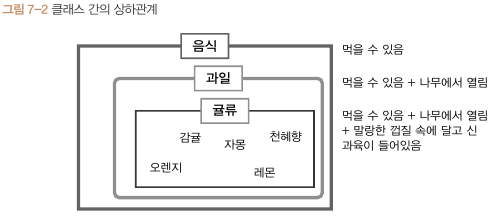
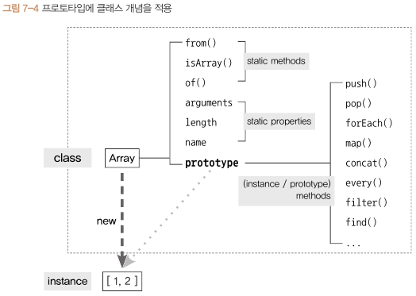
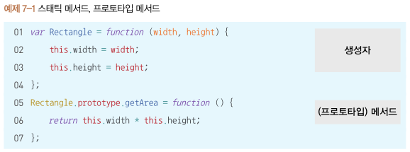
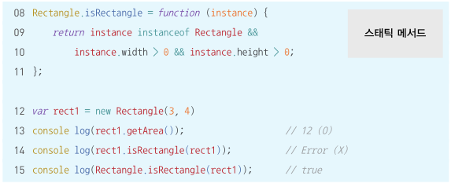
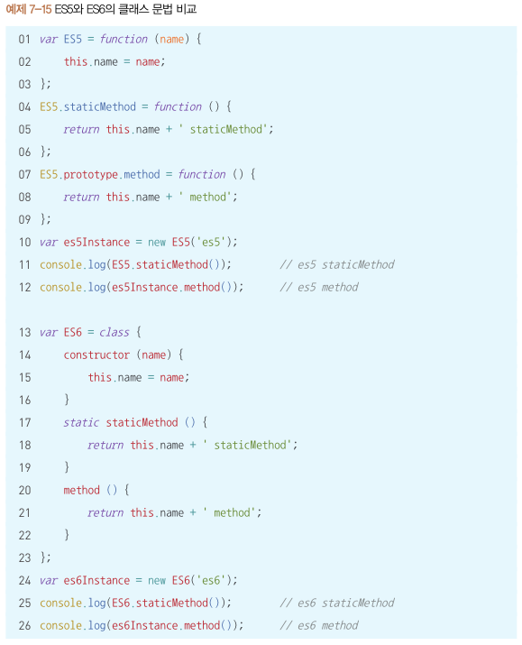

# 7장 클래스

## 7-1. 클래스와 인스턴스의 개념 이해

- 음식은 과일의 상위 클래스, 과일은 음식의 하위클래스
- 하위 개념은 상위 개념을 포함하면서 더 구체적인 개념을 가짐
- 클래스는 하위로 갈수록 상위 클래스의 속성을 상속하면서 더 구체적인 요건이 추가/변경됨
- 인스턴스(instance) : 어떤 클래스의 속성을 지니는 실존하는 개체
  - 사례 : 어떤 조건에 부합하는 구체적인 예시
  - 한 인스턴스는 하나의 클래스만을 바탕으로 만들어짐
  - 위 사진에서 감귤, 오렌지, 레몬 등이 해당
- 프로그래밍에서는 클래스가 먼저 정의돼야만 그로부터 공통적인 요소를 지니는 개체들을 생성할 수 있음

## 7-2. 자바스크립트의 클래스

- 자바스크립트는 프로토타입 기반의 언어이므로 클래스의 개념 존재 X
- 프로토타입 체이닝에 의한 참조로 클래스와 유사한 기능을 구현한 것
- 인스턴스가 참조하는지 여부에 따라 static 멤버와 instance 멤버로 나뉨 (클래스 관점에서 사용 대상에 따라 구분)
  - Array 내부 프로퍼티 중 prototype 프로퍼티만 상속되고 나머지는 상속되지 않음
    
- 클래스 기반 언어와 달리 js에서는 인스턴스에서도 직접 메서드를 정의할 수 있는데 이를 프로토타입 메서드라고 함

- `getArea` 처럼 인스턴스가 직접 호출할 수 있는 메서드가 프로토타입 메서드
- `isRectangle` 처럼 인스턴스에서 직접 접근할 수 없는 메서드가 스태틱 메서드

## 7-3. 클래스 상속

- ES6에서 도입된 클래스는 프로토타입 체이닝을 활용한 것
- ES5에서 클래스를 구현하게 되면 추상적인 틀로서만 작용하지 않음. 클래스에 있는 값이 인스턴스의 동작에 영향
- 프로토타입 체인으로 상속을 흉내내는 것은 구조적으로 불안정하며 복잡

## 7-4. ES6의 클래스 및 클래스 상속

- `constructor` ES5의 생성자 함수와 동일한 역할
- `static` 메서드는 생성자 함수(클래스) 자신만이 가질 수 있는 메서드
- 위 예시에서 method() 는 prototype 객체 내부에 할당되는 메서드. 인스턴스가 프로토타입 체이닝을 통해 마치 자신의 것처럼 호출할 수 있는 메서드

## 7-5. 정리

- 자바스크립트는 프로토타입 기반 언어이기 때문에 클래스와 상속 개념은 존재하지 않지만 프로토타입을 기반으로 클래스와 비슷하게 동작하는 기법들은 존재
- 클래스 : 어떤 사물의 공통 속성을 모아 정의한 추상적인 개념
- 인스턴스 : 클래스의 속성을 지니는 구체적인 사례
- 스태틱 메서드 : 클래스(생성자 함수)에 직접 정의한 메서드
- 프로토타입 메서드 : 클래스의 prototype 내부에 정의된 메서드, 인스턴스가 자신의 메서드인 것처럼 호출 가능
